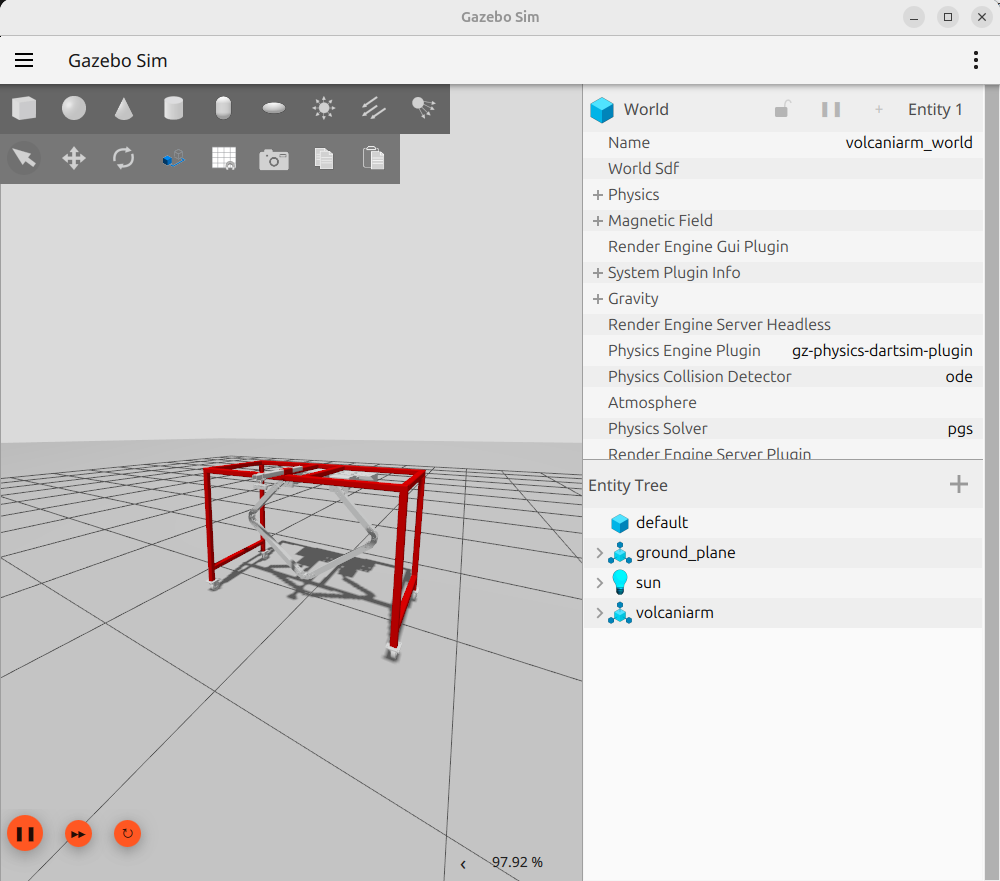

# ROS2 Closed Loop Kinematics Workspace

A test bed for working with closed-loop kinematics in Gazebo using ROS2.

This workspace contains the `volcaniarm_description` package, which demonstrates modeling and simulating robots with closed kinematic chains in the new Gazebo simulator.



## Requirements

- ROS2 Jazzy (Tested)
- Gazebo Harmonic

## Installation

Clone the repository:

```bash
git clone git@github.com:LevinTamir/ros2_closed_loop_ws.git
cd ros2_closed_loop_ws
```

Build the workspace:

```bash
colcon build
```

Source the workspace:

```bash
source install/setup.bash
```

## Usage

Launch the volcaniarm simulation:

```bash
ros2 launch volcaniarm_description launch_volcaniarm.launch.py
```

## Acknowledgements

- [ros2_closed_loop_demo](https://github.com/wiartallajan/ros2_closed_loop_demo)
- [gz_attach_links](https://github.com/oKermorgant/gz_attach_links)
