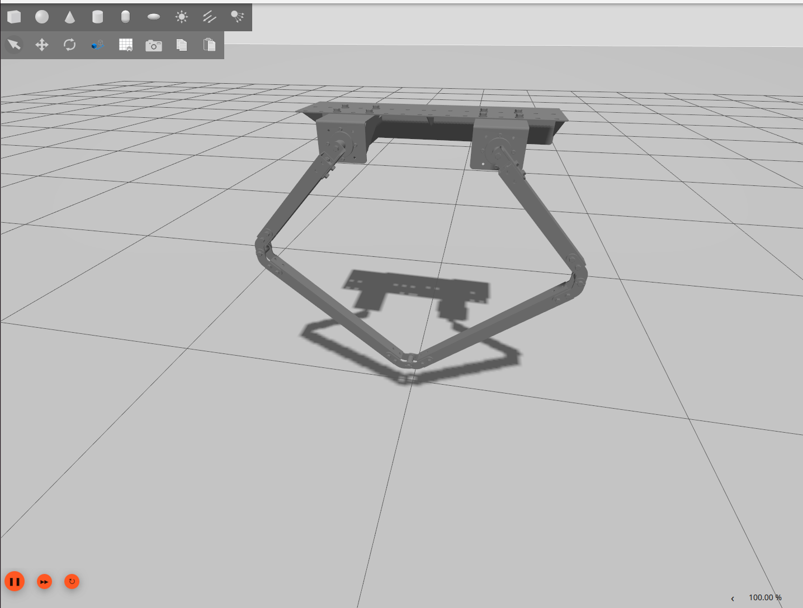
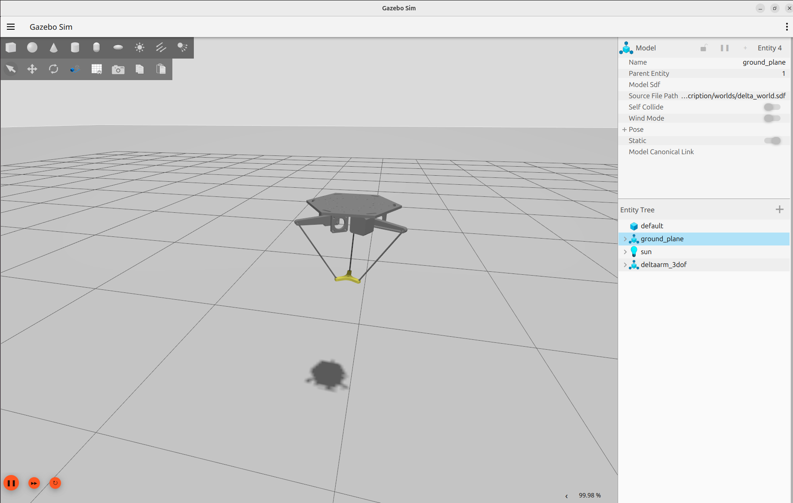
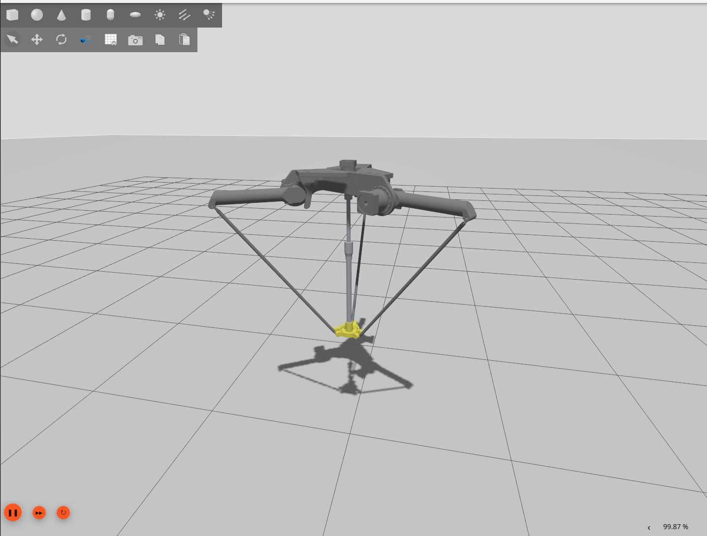

# ROS 2 Closed-Loop Kinematics Workspace

A test bed for modeling and simulating robots with **closed kinematic chains** in the new Gazebo
simulator (Gazebo Harmonic) with ROS 2. Plain URDF can only describe open kinematic *trees*, so this
repo shows a clean, repeatable way to close loops at runtime using Gazebo's `DetachableJoint` system
plugin, and applies it to three robots of increasing complexity.

It is split into two packages: [`closed_loop_description`](src/closed_loop_description) holds the
robot models (URDFs, Gazebo worlds, meshes) and [`closed_loop_bringup`](src/closed_loop_bringup)
holds the launch files that start them.

| Example | What it is | Launch |
|---|---|---|
| **5-bar linkage** | a planar (2D) 5-bar parallel arm | `fivebar_linkage.launch.py` |
| **3-DoF delta** | a translational delta parallel robot | `3dof_delta.launch.py` |
| **4-DoF delta** | a delta with a central telescopic shaft that adds an end-effector rotation axis | `4dof_delta.launch.py` |

<p align="center">
  
  
  
</p>

The 5-bar is the reference example. It is the simplest closed loop, and the
[implementation guide](#implementation-guide-adapting-your-own-robot) below walks through exactly how
its URDF, world, and launch file are wired up. The two deltas reuse the same pattern.

## Requirements

- ROS 2 Jazzy (tested)
- Gazebo Harmonic (`gz sim`)
- `ros_gz_sim`, `ros_gz_bridge`, `robot_state_publisher`

## Installation

```bash
git clone git@github.com:LevinTamir/ros2_closed_loop_ws.git
cd ros2_closed_loop_ws
colcon build
source install/setup.bash
```

## Usage

Open two terminals: one runs the simulation, the other sends joint commands (positions in radians,
`std_msgs/Float64` on `/<robot>/<joint>/cmd_pos`).

### 5-bar linkage (the reference example)

```bash
# terminal 1: simulation
ros2 launch closed_loop_bringup fivebar_linkage.launch.py
```

```bash
# terminal 2: the two motors (Chain1_1 = left, Chain2_1 = right)
ros2 topic pub -1 /fivebar_linkage/Chain1_1/cmd_pos std_msgs/msg/Float64 "{data: 0.3}"
ros2 topic pub -1 /fivebar_linkage/Chain2_1/cmd_pos std_msgs/msg/Float64 "{data: -0.3}"
```

### 3-DoF delta

```bash
ros2 launch closed_loop_bringup 3dof_delta.launch.py
```

```bash
# equal angles on all three arms move the platform up/down; unequal angles move it
# sideways. The platform always stays level.
ros2 topic pub -1 /delta_3dof/Chain1_1/cmd_pos std_msgs/msg/Float64 "{data: 0.4}"
ros2 topic pub -1 /delta_3dof/Chain2_1/cmd_pos std_msgs/msg/Float64 "{data: 0.4}"
ros2 topic pub -1 /delta_3dof/Chain3_1/cmd_pos std_msgs/msg/Float64 "{data: 0.4}"
```

### 4-DoF delta

```bash
ros2 launch closed_loop_bringup 4dof_delta.launch.py
```

```bash
# the three arms translate the platform; Chain4_1 rotates the end-effector flange
ros2 topic pub -1 /delta_4dof/Chain1_1/cmd_pos std_msgs/msg/Float64 "{data: 0.3}"
ros2 topic pub -1 /delta_4dof/Chain4_1/cmd_pos std_msgs/msg/Float64 "{data: 1.0}"
```

> Note: the delta command topics use `delta_3dof` / `delta_4dof` (not `3dof_delta`) because ROS 2
> topic names may not start with a digit.

## Repository structure

```
src/
├── closed_loop_description/        # robot models: what the robots are
│   ├── urdf/                        # per robot: a *.urdf.xacro that includes a *.gazebo.xacro
│   │   ├── fivebar_linkage.urdf.xacro    # links + joints (kinematics, visuals)
│   │   ├── fivebar_linkage.gazebo.xacro  # <gazebo> plugins + loop closures
│   │   ├── 3dof_delta.urdf.xacro
│   │   ├── 3dof_delta.gazebo.xacro
│   │   ├── 4dof_delta.urdf.xacro
│   │   └── 4dof_delta.gazebo.xacro
│   ├── worlds/
│   │   ├── fivebar_world.sdf        # DART physics world for the 5-bar
│   │   └── delta_world.sdf          # DART world for the deltas (dantzig solver)
│   ├── meshes/                      # one folder per robot
│   │   ├── fivebar_linkage/
│   │   ├── PARA_ENGINEER/           # 3-DoF delta meshes
│   │   └── A_00036/                 # 4-DoF delta meshes
│   ├── CMakeLists.txt
│   └── package.xml
└── closed_loop_bringup/            # launch files: how to start them
    ├── launch/
    │   ├── fivebar_linkage.launch.py
    │   ├── 3dof_delta.launch.py
    │   └── 4dof_delta.launch.py
    ├── CMakeLists.txt
    └── package.xml
```

## How the closed loops are modeled

A URDF is a *tree* (every link has exactly one parent), so it cannot, on its own, express a loop.
The loop is instead closed **at runtime** by Gazebo's `DetachableJoint` plugin, which welds two links
together once the model is spawned. The trick that makes this clean is to arrange the two welded
links so their frames are **coincident at the robot's assembled "home" pose**, so the weld attaches
with no snap or impulse. Actuated joints are driven by `JointPositionController` plugins over
`cmd_pos` topics, and the actuated joint positions are reported back on `/joint_states` by a
`JointStatePublisher` plugin, filtered to the active joints so the feedback matches real hardware
(encoders sit on the motors; the passive joints are not measured).

The two deltas extend this. Each forearm rod is given a ball joint at each end (a `DetachableJoint`
weld plus a 3-revolute "spherical" chain reproduces the source `spherical_joint` constraints), and
the moving platform hangs from a passive 3-prismatic X-Y-Z chain so it keeps exactly 3 translational
DOF and stays level by construction.

## Implementation guide: adapting your own robot

This is the recipe for turning an ordinary URDF into a closed-loop Gazebo model, illustrated with the
**5-bar linkage**. A 5-bar has two serial arms (`Chain1` = left, `Chain2` = right) whose tips must
meet, and that meeting point is the loop to close.

Each robot is described by two xacro files. The kinematics (links and joints) live in
[`fivebar_linkage.urdf.xacro`](src/closed_loop_description/urdf/fivebar_linkage.urdf.xacro) and are
shared by both simulation and real hardware. Every simulation-only element (the Gazebo system
plugins and the loop-closure `DetachableJoint`s) lives in
[`fivebar_linkage.gazebo.xacro`](src/closed_loop_description/urdf/fivebar_linkage.gazebo.xacro),
included only when `sim:=true`:

```xml
<robot name="fivebar_linkage" xmlns:xacro="http://www.ros.org/wiki/xacro">
  ...  <!-- links and joints, shared by sim and real -->
  <xacro:arg name="sim" default="true"/>
  <xacro:if value="$(arg sim)">
    <xacro:include filename="fivebar_linkage.gazebo.xacro"/>
  </xacro:if>
</robot>
```

This keeps a clean split between what a *simulated* robot needs and what a *real* one needs: for
real-hardware bringup (`sim:=false`) the Gazebo file is skipped, and a `ros2_control` description
would be included instead. Steps 1 to 3 below go in the `.urdf.xacro`; steps 4 to 6 in the
`.gazebo.xacro`.

### 1. Anchor the robot to the world

Add a `world` link and a fixed joint that places the base. (Here the base sits about 0.96 m up so the
arm hangs below it.)

```xml
<link name="world"/>
<joint name="world_to_base" type="fixed">
  <origin xyz="0.218 0 0.96" rpy="0 3.14159 0"/>
  <parent link="world"/>
  <child link="base_link"/>
</joint>
```

### 2. Model the open chains, ending each in a massless "tip" at the closure point

Keep the kinematics as a normal open tree. On the chain that will be the *parent* of the weld, add a
tiny massless link fixed exactly at the physical closure point. Tell Gazebo **not** to merge this
fixed joint away, otherwise the link disappears and the plugin cannot find it:

```xml
<joint name="Chain2_tip_joint" type="fixed">
  <origin xyz="0 0 0.6225" rpy="0 0 0"/>
  <parent link="Chain2_link_2"/>     <!-- right-arm leaf -->
  <child  link="Chain2_tip"/>        <!-- massless tip at the closure point -->
</joint>
<gazebo reference="Chain2_tip_joint">
  <preserveFixedJoint>true</preserveFixedJoint>
</gazebo>
```

### 3. Add a coincident "dummy" on the other chain

On the *child* chain, add a matching dummy link. The key is its joint `origin`: choose the `rpy` so
that, at the home pose (all joints at 0), the dummy's world frame **coincides** with `Chain2_tip`'s.
Here a `revolute` provides the one passive DOF the closed 5-bar needs, and `rpy="1.8398 0 0"` aligns
the two frames:

```xml
<joint name="Chain1_closure" type="revolute">
  <origin xyz="0 0 0.6225" rpy="1.8398 0 0"/>  <!-- tuned so Chain1_dummy == Chain2_tip at q=0 -->
  <parent link="Chain1_link_2"/>               <!-- left-arm leaf -->
  <child  link="Chain1_dummy"/>
  <axis xyz="1 0 0"/>
  <limit lower="-3.14" upper="3.14" effort="0" velocity="10"/>
</joint>
```

### 4. Close the loop with a DetachableJoint

A single plugin welds the two leaves. `child_model` **must equal the name the robot is spawned with**
(see the launch file). Because the frames coincide at home, the weld is an identity transform, so
there is no snap:

```xml
<gazebo>
  <plugin filename="libgz-sim-detachable-joint-system.so"
          name="gz::sim::systems::DetachableJoint">
    <parent_link>Chain2_tip</parent_link>
    <child_model>fivebar_linkage</child_model>
    <child_link>Chain1_dummy</child_link>
  </plugin>
</gazebo>
```

### 5. Drive the actuated joints

One `JointPositionController` per motor, each listening on its own `cmd_pos` topic with PID gains:

```xml
<gazebo>
  <plugin filename="libgz-sim-joint-position-controller-system.so"
          name="gz::sim::systems::JointPositionController">
    <joint_name>Chain1_1</joint_name>
    <topic>/fivebar_linkage/Chain1_1/cmd_pos</topic>
    <p_gain>10</p_gain>
    <i_gain>1</i_gain>
    <d_gain>1</d_gain>
    <i_max>5</i_max>
    <i_min>-5</i_min>
    <cmd_max>10</cmd_max>
    <cmd_min>-10</cmd_min>
  </plugin>
</gazebo>
```

### 6. Publish joint states (active joints only)

A `JointStatePublisher` plugin reports joint positions back to ROS. With no filter it publishes
*every* joint, but to mimic real hardware (encoders on the actuated motors only; the passive joints
are not measured) we list just the actuated joints:

```xml
<gazebo>
  <plugin filename="libgz-sim-joint-state-publisher-system.so"
          name="gz::sim::systems::JointStatePublisher">
    <joint_name>Chain1_1</joint_name>
    <joint_name>Chain2_1</joint_name>
  </plugin>
</gazebo>
```

The launch file bridges this Gazebo topic to ROS and remaps it to `/joint_states`. Recovering the
passive joint angles from only these active readings is the forward-kinematics problem that a
closed-loop solver such as [`joint_state_transformer`](https://github.com/HIT-Robotics/joint_state_transformer_example)
addresses.

### 7. The Gazebo world

Closed loops are stiff, so the world ([`fivebar_world.sdf`](src/closed_loop_description/worlds/fivebar_world.sdf))
selects the **DART** physics engine and loads the standard system plugins. For tougher loops (the
deltas) switch the solver from `pgs` to `dantzig` and shrink the step, as in `delta_world.sdf`:

```xml
<physics name="1ms" type="dart">
  <max_step_size>0.001</max_step_size>
  <dart>
    <solver><solver_type>pgs</solver_type></solver>  <!-- dantzig for stiffer loops -->
    <collision_detector>ode</collision_detector>
  </dart>
</physics>
<plugin filename="gz-sim-physics-system"           name="gz::sim::systems::Physics"/>
<plugin filename="gz-sim-user-commands-system"     name="gz::sim::systems::UserCommands"/>
<plugin filename="gz-sim-scene-broadcaster-system" name="gz::sim::systems::SceneBroadcaster"/>
<plugin filename="gz-sim-contact-system"           name="gz::sim::systems::Contact"/>
```

### 8. The launch file

The launch file ([`fivebar_linkage.launch.py`](src/closed_loop_bringup/launch/fivebar_linkage.launch.py))
ties it together: process the xacro into `robot_description` (`xacro.process_file(...).toxml()`), set
`GZ_SIM_RESOURCE_PATH` so `package://`
mesh paths resolve, start Gazebo with the world, spawn the model from the `robot_description` topic,
and bridge `/clock` plus the `cmd_pos` topics with `ros_gz_bridge`:

```python
# spawn the model. The -name MUST match <child_model> in the DetachableJoint
Node(package="ros_gz_sim", executable="create",
     arguments=["-topic", "robot_description", "-name", "fivebar_linkage"])

# bridge ROS <-> Gazebo. Syntax: <topic>@<ros_type>[<gz_type>  ('[' = gz to ros, ']' = ros to gz)
js = "/world/fivebar_world/model/fivebar_linkage/joint_state"
Node(package="ros_gz_bridge", executable="parameter_bridge",
     arguments=[
        "/clock@rosgraph_msgs/msg/Clock[gz.msgs.Clock",
        "/fivebar_linkage/Chain1_1/cmd_pos@std_msgs/msg/Float64]gz.msgs.Double",
        "/fivebar_linkage/Chain2_1/cmd_pos@std_msgs/msg/Float64]gz.msgs.Double",
        js + "@sensor_msgs/msg/JointState[gz.msgs.Model",  # active-joint encoders, gz -> ros
     ],
     remappings=[(js, "/joint_states")])
```

### For parallel robots (the deltas)

The deltas apply steps 1 to 8 per leg, but each forearm rod uses a **ball joint at both ends** (a
`DetachableJoint` weld plus a 3-revolute spherical chain) instead of a single revolute, and the
moving platform hangs from a **passive 3-prismatic X-Y-Z chain** so it keeps 3 translational DOF and
stays level. As with the 5-bar, the assembled home pose is chosen so every weld is coincident at
spawn, which gives a clean zero-impulse attach.

## Acknowledgements

- [ros2_closed_loop_demo](https://github.com/wiartallajan/ros2_closed_loop_demo)
- [gz_attach_links](https://github.com/oKermorgant/gz_attach_links)
- [joint_state_transformer_example](https://github.com/HIT-Robotics/joint_state_transformer_example): source of the delta robot descriptions (Heilbronn University of Applied Sciences, supported by Autonox robotics GmbH).
